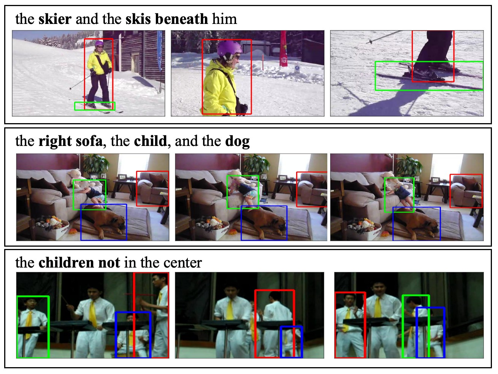

<h2 align="center"> <a href="https://arxiv.org/abs/2604.10527">STORM: End-to-End Referring Multi-Object Tracking in Videos</a></h2>


This repo provides the STORM-Bench data for **STORM: End-to-End Referring Multi-Object Tracking in Videos**.




STORM-Bench is a large-scale benchmark for referring multi-object tracking (RMOT), built from VidOR videos with accurate trajectories and diverse, unambiguous referring expressions generated through a bottom-up annotation pipeline with MLLM verification. Unlike prior RMOT datasets limited to pedestrians or vehicles, STORM-Bench covers 80 everyday object classes with attributes, spatial relations, temporal interactions, and multi-object references.

Using STORM-Bench, we developed STORM (Spatial-Temporal Object Referential Model), an end-to-end multimodal LLM that jointly grounds and tracks objects from language without external detectors or trackers. Combined with Task-Composition Learning (TCL), which transfers skills from image grounding and single-object tracking data, STORM achieves 66.7 HOTA and 78.3 IDF1 on STORM-Bench, outperforming adapted baselines including Grounding DINO, Qwen2.5-VL, VisionLLMv2, and LaMOT.

## Data Statistics

All clips come from VidOR videos. The test split (from VidOR validation videos) is used for STORM-Bench evaluation; the train split (from VidOR training videos) provides training data. All frame references are sampled at **1 fps** and stored as paths relative to a user-provided frame root.

| Split | Annotated Clips | Frames | Tracks | Expressions |
|-------|-------|--------|--------|-------------|
| Train | 6,009 | 80,996 | 26,765 | 27,896 |
| Test | 714 | 9,621 | 3,168 | 2,804 |
| **Total** | **6,723** | **90,617** | **29,933** | **30,700** |

The release also includes 8,144 VidOR clips without referring expressions (7,289 train + 855 test) for a total of 14,867 clips. These MOT-only clips provide additional tracking data and are included for completeness.

### Referring Expression Statistics

| Metric | Train | Test | Total |
|--------|-------|------|-------|
| Expressions | 27,896 | 2,804 | 30,700 |
| Vocabulary size | 3,468 | 1,099 | 3,662 |
| Avg. word length | 7.9 | 7.9 | 7.9 |
| Median word length | 7.0 | 7.0 | 7.0 |
| Max word length | 30 | 25 | 30 |
| Avg. char length | 39.8 | 40.4 | 39.8 |
| Avg. targets per expression | 2.11 | 2.11 | 2.11 |

Expressions cover attributes (e.g., *"the child in green"*), spatial relations (*"the person on the left"*), object interactions (*"the hand and the fish it is holding"*), and multi-object references (*"the woman, the child, and the table"*), with up to 10 target objects per expression.

## Data Format

Each clip stores identity fields, frame paths, object tracks, and optional referring expressions:

```jsonc
{
  "clip_id": "Vidor_val_0079_3355698421.mp4_partition0",
  "source": "VidOR",
  "split": "test",
  "dataset": "VidOR",
  "video_id": "3355698421",
  "group_id": "0079",
  "fps": 29,
  "width": 640,
  "height": 360,
  "frames": [
    "VidOR/validation-frames/0079/3355698421/frame_000001.jpg"
  ],
  "tracks": {
    "0": [
      {"frame_idx": 0, "bbox": [171, 227, 233, 404]}
    ]
  },
  "referring_expressions": [
    {
      "caption": "the hand and the fish it is holding",
      "track_ids": [0, 1]
    }
  ]
}
```

Important conventions:

- `split` is `"train"` or `"test"`. Test clips have `Vidor_val_*` IDs (from VidOR validation videos); train clips have `Vidor_train_*` IDs.
- `bbox` uses `xyxy` format: `[x1, y1, x2, y2]` in pixels, 0-indexed.
- `frames` is ordered, and `frame_idx` indexes into that list.
- `tracks` keys are strings because JSON object keys are strings.
- `referring_expressions[].track_ids` are integers. Compare with `int(track_key) == track_id`.
- `referring_expressions` is empty for clips without RMOT language annotations.

Each source video can be split into consecutive temporal partitions, reflected by clip IDs such as `_partition0`, `_partition1`, and `_partition2`. Within a clip, tracks may enter or leave the scene, so a track does not need to have a box for every frame.

For RMOT clips, each referring expression describes one or more target tracks. A caption may refer to shared attributes, object interactions, or spatial-temporal relations, matching the paper's goal of evaluating language-guided multi-object tracking rather than category-only tracking.

## Prepare VidOR Frames

The annotation file stores relative frame paths. To run models or inspect clips, prepare a local frame root with the expected source layouts.

### 1. Download VidOR Videos

Download VidOR validation and training videos from the official VidOR page:

```text
https://xdshang.github.io/docs/vidor.html
```

The validation set (~2.9 GB, 625 videos) is needed for test-split frames. The training set is needed for train-split frames.

### 2. Extract Frames

Extract frames at 1 fps from the downloaded videos using FFmpeg. The parent repository includes scripts that reproduce exactly the frames referenced by `storm-bench.json`:

```bash
# From the parent repository root
python3 scripts/reproduce_step2_frames.py --family Vidor \
  --ffmpeg tools/bin/ffmpeg \
  --ffprobe tools/bin/ffprobe
```

See [`../README.md`](../README.md) for the full reproduction guide, FFmpeg setup, expected outputs, and troubleshooting notes.

### 3. Expected Frame Layout

After setup, use a frame root with this structure:

```text
<frame_root>/
  VidOR/
    validation-frames/
      {group_id}/{video_id}/{frame_file}.jpg
    training-frames/
      {group_id}/{video_id}/{frame_file}.jpg
```

Example paths from the JSON resolve as:

```text
VidOR/validation-frames/0079/3355698421/frame_000001.jpg   (test split)
VidOR/training-frames/0079/3836995607/frame_000001.jpg     (train split)
```


## Quick Start

```python
import json
from pathlib import Path

with open("storm-bench.json", "r", encoding="utf-8") as f:
    data = json.load(f)

frame_root = Path("/path/to/your/frame_root")

for clip_id, clip in data["clips"].items():
    frame_paths = [frame_root / rel_path for rel_path in clip["frames"]]

    for track_id, annotations in clip["tracks"].items():
        for ann in annotations:
            frame_path = frame_paths[ann["frame_idx"]]
            x1, y1, x2, y2 = ann["bbox"]

    for ref in clip["referring_expressions"]:
        caption = ref["caption"]
        target_track_ids = ref["track_ids"]
```

Filter by split or task:

```python
# Train split only
train_clips = {
    cid: clip for cid, clip in data["clips"].items()
    if clip["split"] == "train"
}

# Test split only
test_clips = {
    cid: clip for cid, clip in data["clips"].items()
    if clip["split"] == "test"
}

# RMOT clips only (clips with referring expressions)
rmot_clips = {
    cid: clip for cid, clip in data["clips"].items()
    if clip["referring_expressions"]
}

# RMOT test clips (for evaluation)
rmot_test = {
    cid: clip for cid, clip in data["clips"].items()
    if clip["split"] == "test" and clip["referring_expressions"]
}
```

## Citation

If you use this benchmark, please cite the STORM paper:

```bibtex
@article{lu2026storm,
  title={STORM: End-to-End Referring Multi-Object Tracking in Videos},
  author={Lu, Zijia and Yi, Jingru and Wang, Jue and Chen, Yuxiao and Chen, Junwen and Li, Xinyu and Modolo, Davide},
  journal={Proceedings of the IEEE/CVF Conference on Computer Vision and Pattern Recognition Findings (CVPRF)},
  year={2026}
}
```
